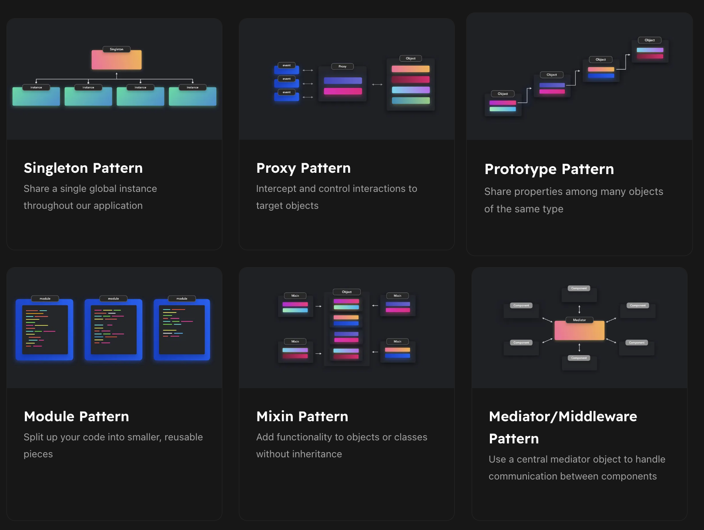
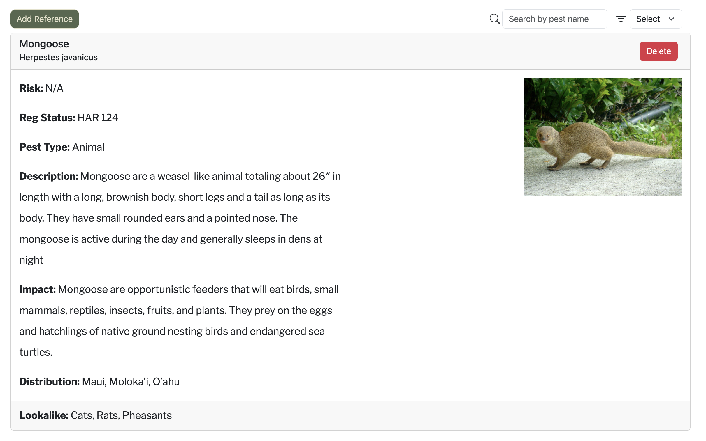

## Like Plaid!?

What are design patterns? Now you can make many different guesses on what it could possibly be, like plaid on a dress. Originally an idea by Christopher Alexander, developers decide to apply these ideas into the realm of software engineering. In terms of software engineering, I would define it as a means of a solution to a recurring problem. Let's say for instance we have a million users that whenever they visit your website encounter a problem. Now we have a general solution that can solve it and could be used in other domains of your program.

## Cooking With Design Patterns

Design patterns I have implemented into my code, the easiest one I can remember is in my group IslandInvaders. We are working on an invasive species tracker website. I'm in charge of an encyclopedia page that houses all the invasive species across the State. However, the admin version will be slightly different. Regular users can only read but admins can read and write. In their version of the page, they can delete a species from the MongoDB from the site. And also view. This has the design pattern of Observer design pattern, more specifically a reactivity type pattern.

The observer design pattern follows the idea that we have data that will update and change, and when it does shall automatically notify the viewers of it. In terms of our website, my portion of the project. Our observers are just regular users of the site who can report invasive species and also learn more about them. The publishers of our data are specialist and certified publishers who can teach observers about invasive species in the Hawaiian Islands.

Our group's final project is made in meteor so it does contain reactive data with the away we reference . My page each time it is visited will always grab the items inside of the MongoDB collection and display it as individual cards. Because of that whenever a new page is deleted or added, new users will be immediately notified.

## My Final Thoughts

Overall, I believe that design patterns are extremely important when creating software and for software engineers. Anytime we use software we experience patterns but have not recognized when we have come over time to develop and refine methods of using object-oriented software to allow users and even publishers to have a smoother time. I hope that if I pursue a software engineering career and for personal projects as well, I will take the time to implement design patterns in my code, and in a way maybe even my life.
