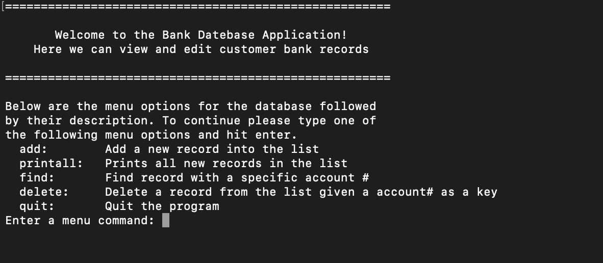

# Let's Store Your Data

The application allows the user to add bank records saved as a struct, containing an account number, customer name, and address. It is fully functional allowing only positive account numbers, spaces for a customer's full name, and allows for multiple lines for address levels. The data is saved in a linked list on the heap. When the application is exited it saves all the user data inputted into a file, so the next time the software is run it reads and puts in the same data into the list. As a bonus to the default constructor as a blank database, I also implemented a copy constructor that takes an already-made database and copies the values over to the newly defined one.

Here is the **struct record** which the database is based off of: 
```cpp
struct record
{
    int                accountno;
    char               name[30];
    char               address[50];
    struct record*     next;
};
```

The code was conceived as if it were a real-world project. It contains a debug mode called during compilation that allows users to see what values variables are stored. Also with the project is a list of test cases that I, acting as both the programmer and tester, must do to ensure the code produces the desired output from a user perspective.

Here is an example of debug mode when called in the **addRecord()** method:
```cpp
int llist::addRecord(int accountno, char name[], char address[])
{
    #ifdef DEBUG_MODE
        cout << "!!!!!!!!!!!!!!!!!!!!!!!!!!!!!!!!!!" << endl;
        cout << "DEBUG Entering: addRecord" << endl;
        cout << "Formal Parameter(s):" << endl;
        cout << "accNum (int) :     " << accountno << endl;
        cout << "Name (char[] ) :   " << name << endl;
        cout << "Address (char[]) : " << address << endl;
        cout << "!!!!!!!!!!!!!!!!!!!!!!!!!!!!!!!!!!\n\n";
    #endif
```

## Overall Reflections

This project was completed as an assignment for my program structures class taught by Professor Ravi Narayan here at the University of Hawaii at Manoa. This is technically the project's second iteration, as the original version of the software I made was made completely in C. The original used struts and passes. What this improved upon the code was the use to make more ease of use for different users and also for the programmer to implement new methods. While making this application we went through the whole process of understanding each class method.

Overall this application has the basis with user information being a foundation for any user-database software. It would be entering the different paths I could take, each one varying with the inclusion of new classes and structures. This is a project I am very proud of as almost all of the code was created and figured out by me. This class has been one of the most beneficial to me as a computer science student helping me understand what goes on behind the scenes to effectively manipulate it from the front.
