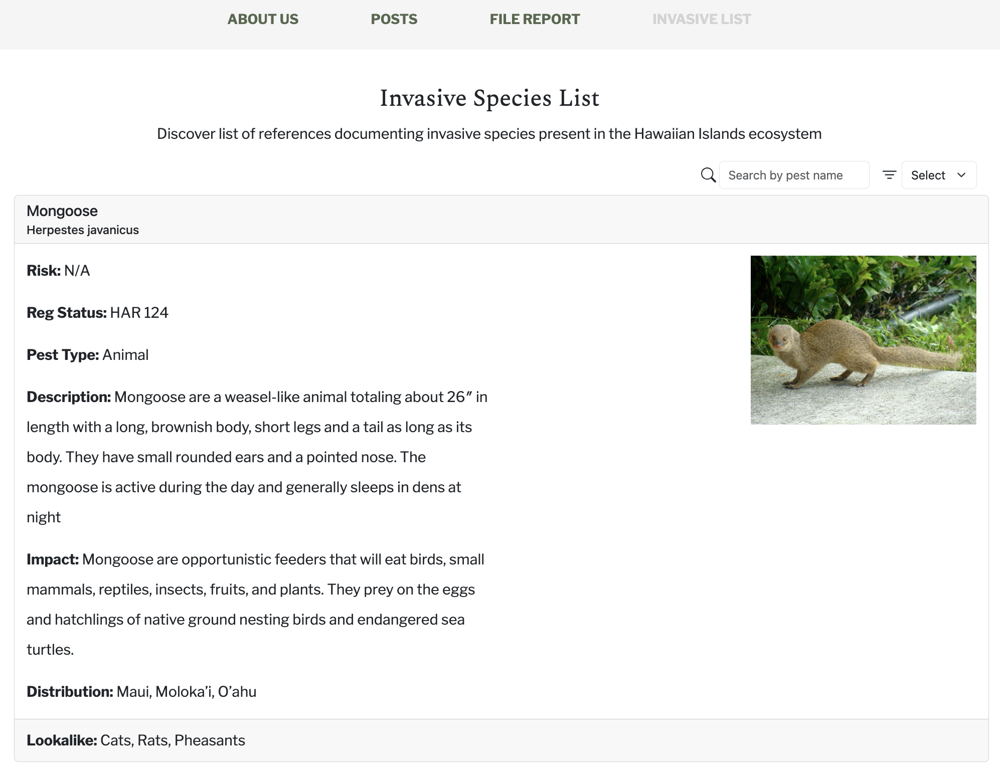

## Final Project

As the last large assignment for my software engineering class, we were broken into groups to make a website using all the things we learned. The group consisted of my and my friends and our goal was to build an invasive species tracker. We built the 

## Imi' Invasive

[**Imi' Invasive**](https://imi-invasive.me/) was created to track down invasive species among the Hawaiian Islands. Imi' is a hawaiian word that stands for 'search' it quite literally means search for invasive. Personally I really like this concept for a website. There are quite a lot of invasive species in Hawaii and many of them harm our native wild life. For example our logo contains the Mongoose which is a well-known invasive species on the island. It likes to feed on bird eggs and has played a critical in a decline on native bird populations.

The site contains landing page that explains the concept I just described. It has an 'about us' tab to learn about the team and me. The main part of the website is the post and resource pages. There we can post about sighting to the public so other people can see it. The resources page allows all people from locals and visitors to learn about invasive species among the island. There is an admin version of the site that allows us to have moderation in user posts and accounts. Admins are also able to add new inside species and also delete from our collection. This allows for a dynamic and growing site.

## Check 1,2,3 Testing

One part of the project that I was extremely hands-on was the testing of our application. We used TestCafe to handle our tests which was a software tool that basically opens your site and has mouse cursor that you can control with different commands. I think originally we were going to test our own implementation of the code but since I started first I was able to get a grasp of the tool, so it was easier and faster for me to get it all done. What I failed to realize then was that a site has more functionality tact you realize. We have user login, user interface, and admin interface and within them is certain functionality that pertains just to those areas. I think I learned about building tests that I can apply to my future personal projects. Here is an example of a test case I created:

```js
test('Test access to user resources page', async (testController) => {
  // Login and go to page
  await loginComponent.testLogin(testController, credentials);
  await testController.wait(1000);
  await navBar.gotoResourcesPage(testController);
  await resourcesPage.isDisplayed(testController);
  // Test search and filter
  await resourcesPage.search(testController, pestName);
  await resourcesPage.filter(testController, 'Plant');
  // Log out
  await loginComponent.logout(testController);
  await signoutPage.isDisplayed(testController);
});
```

Here is a test for one of the pages I built, the resources page. This page is design to allow users scroll through view cards of invasive species containing information about them. The tests are commented into three different parts. We test that our navbar works to go the page. The next test is the filter functionally, we have two different types: 1) a regular text search, 2) a dropdown to filter by type (i.e. plant, animal).




## Final Project, Final Thoughts

Overall, I am extremely happy to have been on this project and work with all of my group mates. I got to learn many different aspects of building a website like this. From good communication, better understanding of GitHub, using MongoDB, and more. Below you can find more information about the project.

[**Click Here for Our Organization Project Page!**](https://islandinvaders.github.io/)