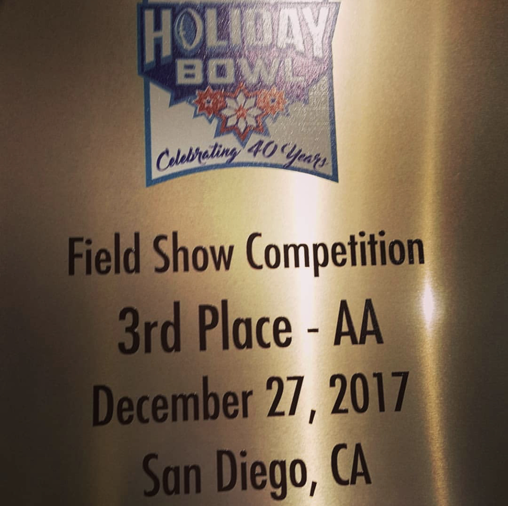
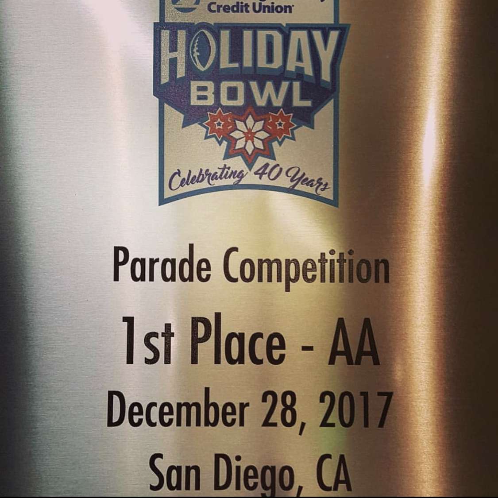

  
  

## Music Is Life
I've been enjoying music for as long as I can remember. Playing the drums since elementary, when I came into middle school I decided to join a band and it was one of the best decisions of my life. The band came with so many memories from concerts, parades, and just practicing with friends. Inside the band room was an environment I can't recreate.

## To the Mainland!

One of my favorite memories from the band was participating in the Kauai All Island Band. United together by my middle school band director Ms. Sarah Tochiki, we had young students from across all the middle and high schools on the Island of Kauai to join together to create something special. Here we practiced all summer of 2017 leading up to December to travel to California. There we were set to perform but also compete in the Holiday Bowl parade, and also participated in a field show competition. The winner of the field show would get to play as the opening for the pregame to the Holiday Bowl. However, everyone who participated was included to play in the halftime show. Consisting of songs that represent Hawai'i, Our parade song was the Hawaiian song Kana'i Aupuni. We incorporate hula steps into our marching.

We were able to secure first place in the parade for our unique and authentic sound along with distinct movements. For our field show, we placed them there. To this day I am very proud of everyone's work and still get shivers watching our performances.

## Memories That Last

I am only just one member out of the whole band, none of that would have been possible without everyone's hard dedication. Something that still sticks with me is what Ms. Tochiki said: "We are as good as our weakest player." I learned to be selfless in a way and to make sure you pull your weight because everyone else relies on each other. Sadly we had set sights on traveling to Japan in the summer of 2020, but the COVID pandemic stopped us from going.
